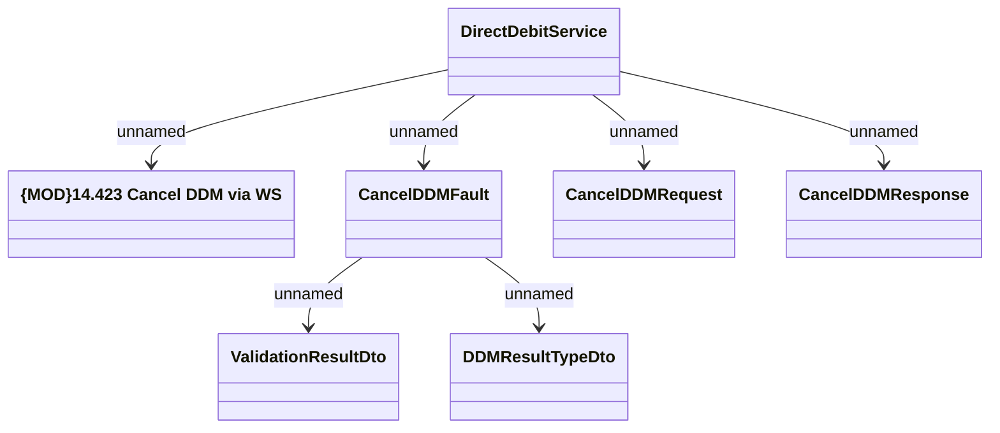

# DirectDebitMandate.cancelDDM

```mermaid
classDiagram
    class DDMResultTypeDto["DDMResultTypeDto"]
    class MOD_14_423_Cancel_DDM_via_WS["{MOD}14.423 Cancel DDM via WS"]
    class ValidationResultDto["ValidationResultDto"]
    class CancelDDMFault["CancelDDMFault"]
    class CancelDDMRequest["CancelDDMRequest"]
    class CancelDDMResponse["CancelDDMResponse"]
    class DirectDebitService["DirectDebitService"]
    CancelDDMFault --> ValidationResultDto : unnamed
    CancelDDMFault --> DDMResultTypeDto : unnamed
    DirectDebitService --> MOD_14_423_Cancel_DDM_via_WS : unnamed
    DirectDebitService --> CancelDDMRequest : unnamed
    DirectDebitService --> CancelDDMFault : unnamed
    DirectDebitService --> CancelDDMResponse : unnamed
```
