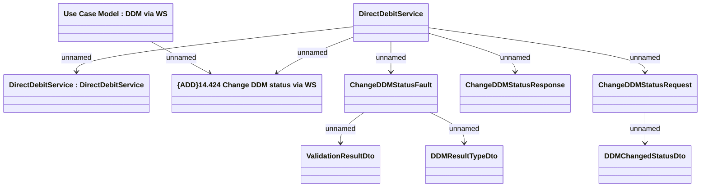

# DirectDebitService.changeDDMStatus

```mermaid
classDiagram
    class DirectDebitService_DirectDebitService["DirectDebitService : DirectDebitService"]
    class Use_Case_Model_DDM_via_WS["Use Case Model : DDM via WS"]
    class ADD_14_424_Change_DDM_status_via_WS["{ADD}14.424 Change DDM status via WS"]
    class ChangeDDMStatusFault["ChangeDDMStatusFault"]
    class DDMResultTypeDto["DDMResultTypeDto"]
    class ValidationResultDto["ValidationResultDto"]
    class ChangeDDMStatusResponse["ChangeDDMStatusResponse"]
    class ChangeDDMStatusRequest["ChangeDDMStatusRequest"]
    class DDMChangedStatusDto["DDMChangedStatusDto"]
    class DirectDebitService["DirectDebitService"]
    ChangeDDMStatusRequest --> DDMChangedStatusDto : unnamed
    ChangeDDMStatusFault --> ValidationResultDto : unnamed
    ChangeDDMStatusFault --> DDMResultTypeDto : unnamed
    Use_Case_Model_DDM_via_WS --> ADD_14_424_Change_DDM_status_via_WS : unnamed
    DirectDebitService --> ChangeDDMStatusFault : unnamed
    DirectDebitService --> ChangeDDMStatusRequest : unnamed
    DirectDebitService --> ChangeDDMStatusResponse : unnamed
    DirectDebitService --> ADD_14_424_Change_DDM_status_via_WS : unnamed
    DirectDebitService --> DirectDebitService_DirectDebitService : unnamed
```
