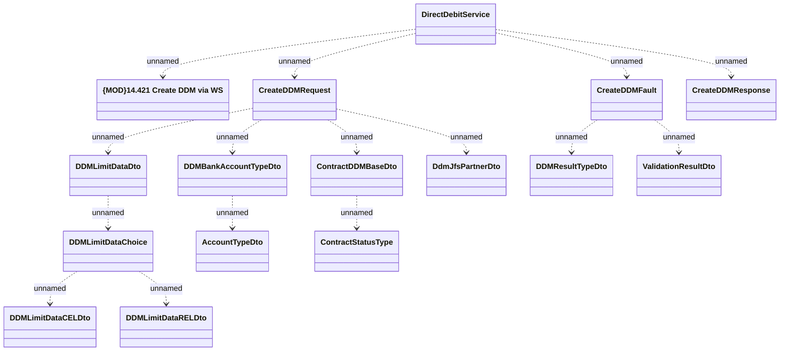

# DirectDebitService.createDDM

- **Diagram Type**: Logical
- **Package**: HomerSelect/BSL/Analysis Model/_Interface/Provided Web Services/Payments/DirectDebitService/createDDM
- **Diagram ID**: 139606
- **Elements**: 16
- **Connectors**: 15

