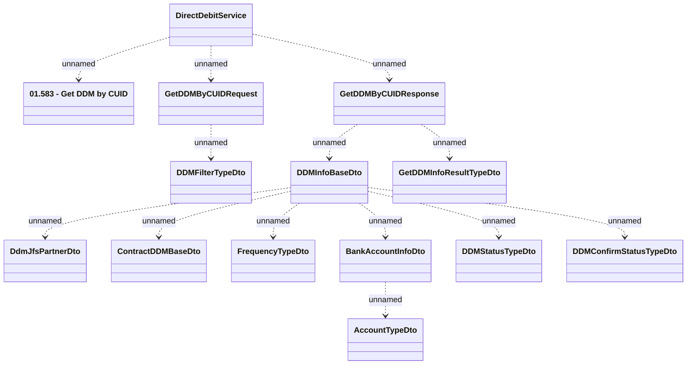

# DirectDebitService.getDDMByCUID

- **Diagram Type**: Logical
- **Package**: HomerSelect/BSL/Analysis Model/_Interface/Provided Web Services/Payments/DirectDebitService/getDDMByCUID
- **Diagram ID**: 136604
- **Elements**: 14
- **Connectors**: 13

