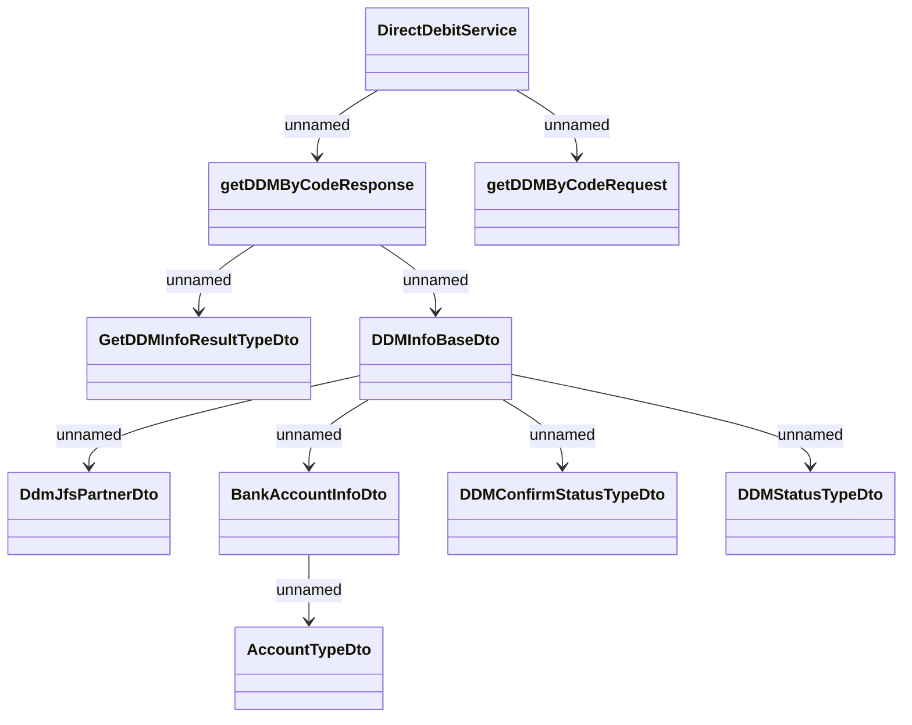

# DirectDebitService.getDDMByCode

```mermaid
classDiagram
    class DdmJfsPartnerDto["DdmJfsPartnerDto"]
    class GetDDMInfoResultTypeDto["GetDDMInfoResultTypeDto"]
    class AccountTypeDto["AccountTypeDto"]
    class BankAccountInfoDto["BankAccountInfoDto"]
    class DDMConfirmStatusTypeDto["DDMConfirmStatusTypeDto"]
    class DDMStatusTypeDto["DDMStatusTypeDto"]
    class DDMInfoBaseDto["DDMInfoBaseDto"]
    class getDDMByCodeResponse["getDDMByCodeResponse"]
    class getDDMByCodeRequest["getDDMByCodeRequest"]
    class DirectDebitService["DirectDebitService"]
    getDDMByCodeResponse --> DDMInfoBaseDto : unnamed
    getDDMByCodeResponse --> GetDDMInfoResultTypeDto : unnamed
    DDMInfoBaseDto --> BankAccountInfoDto : unnamed
    BankAccountInfoDto --> AccountTypeDto : unnamed
    DDMInfoBaseDto --> DDMConfirmStatusTypeDto : unnamed
    DDMInfoBaseDto --> DDMStatusTypeDto : unnamed
    DDMInfoBaseDto --> DdmJfsPartnerDto : unnamed
    DirectDebitService --> getDDMByCodeRequest : unnamed
    DirectDebitService --> getDDMByCodeResponse : unnamed
```
