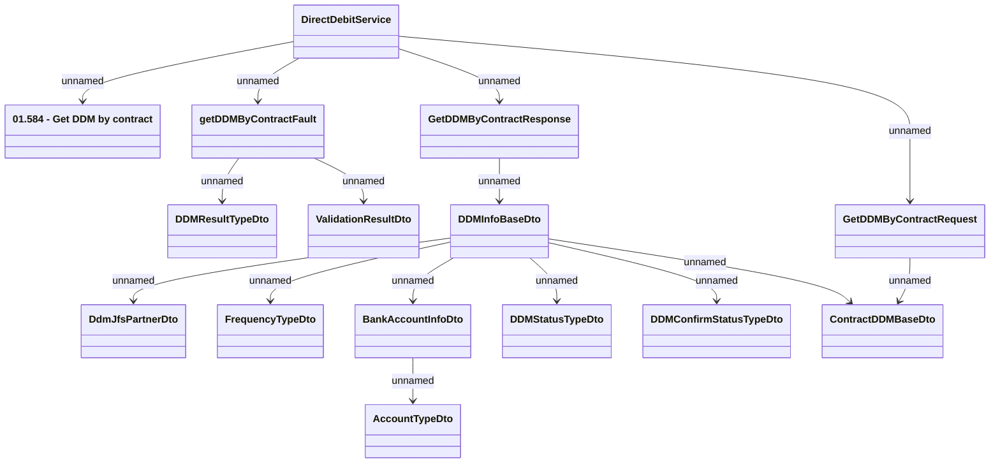

# DirectDebitService.getDDMByContract

```mermaid
classDiagram
    class DdmJfsPartnerDto["DdmJfsPartnerDto"]
    class n_01_584_Get_DDM_by_contract["01.584 - Get DDM by contract"]
    class DDMResultTypeDto["DDMResultTypeDto"]
    class ValidationResultDto["ValidationResultDto"]
    class getDDMByContractFault["getDDMByContractFault"]
    class FrequencyTypeDto["FrequencyTypeDto"]
    class AccountTypeDto["AccountTypeDto"]
    class BankAccountInfoDto["BankAccountInfoDto"]
    class DDMStatusTypeDto["DDMStatusTypeDto"]
    class DDMConfirmStatusTypeDto["DDMConfirmStatusTypeDto"]
    class DDMInfoBaseDto["DDMInfoBaseDto"]
    class ContractDDMBaseDto["ContractDDMBaseDto"]
    class GetDDMByContractResponse["GetDDMByContractResponse"]
    class GetDDMByContractRequest["GetDDMByContractRequest"]
    class DirectDebitService["DirectDebitService"]
    GetDDMByContractRequest --> ContractDDMBaseDto : unnamed
    GetDDMByContractResponse --> DDMInfoBaseDto : unnamed
    getDDMByContractFault --> ValidationResultDto : unnamed
    getDDMByContractFault --> DDMResultTypeDto : unnamed
    DirectDebitService --> GetDDMByContractResponse : unnamed
    DirectDebitService --> n_01_584_Get_DDM_by_contract : unnamed
    DirectDebitService --> GetDDMByContractRequest : unnamed
    DirectDebitService --> getDDMByContractFault : unnamed
    DDMInfoBaseDto --> BankAccountInfoDto : unnamed
    BankAccountInfoDto --> AccountTypeDto : unnamed
    DDMInfoBaseDto --> ContractDDMBaseDto : unnamed
    DDMInfoBaseDto --> FrequencyTypeDto : unnamed
    DDMInfoBaseDto --> DDMConfirmStatusTypeDto : unnamed
    DDMInfoBaseDto --> DDMStatusTypeDto : unnamed
    DDMInfoBaseDto --> DdmJfsPartnerDto : unnamed
```
