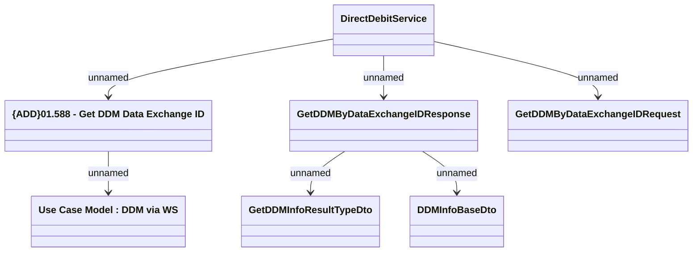

# DirectDebitService.getDDMByDataExchangeID

```mermaid
classDiagram
    class Use_Case_Model_DDM_via_WS["Use Case Model : DDM via WS"]
    class ADD_01_588_Get_DDM_Data_Exchange_ID["{ADD}01.588 - Get DDM Data Exchange ID"]
    class GetDDMInfoResultTypeDto["GetDDMInfoResultTypeDto"]
    class DDMInfoBaseDto["DDMInfoBaseDto"]
    class GetDDMByDataExchangeIDResponse["GetDDMByDataExchangeIDResponse"]
    class GetDDMByDataExchangeIDRequest["GetDDMByDataExchangeIDRequest"]
    class DirectDebitService["DirectDebitService"]
    GetDDMByDataExchangeIDResponse --> GetDDMInfoResultTypeDto : unnamed
    GetDDMByDataExchangeIDResponse --> DDMInfoBaseDto : unnamed
    DirectDebitService --> GetDDMByDataExchangeIDRequest : unnamed
    DirectDebitService --> ADD_01_588_Get_DDM_Data_Exchange_ID : unnamed
    DirectDebitService --> GetDDMByDataExchangeIDResponse : unnamed
    ADD_01_588_Get_DDM_Data_Exchange_ID --> Use_Case_Model_DDM_via_WS : unnamed
```
