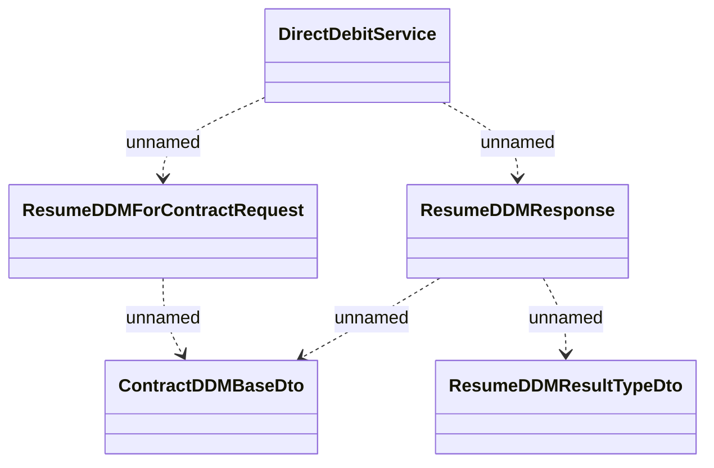

# DirectDebitService.resumeDDM

- **Diagram Type**: Logical
- **Package**: HomerSelect/BSL/Analysis Model/_Interface/Provided Web Services/Payments/DirectDebitService/resumeDDM
- **Diagram ID**: 112788
- **Elements**: 5
- **Connectors**: 5

