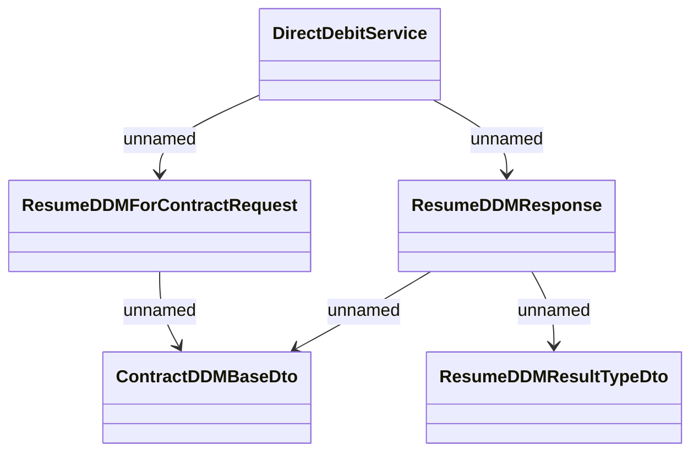

# DirectDebitService.resumeDDM

```mermaid
classDiagram
    class ResumeDDMResultTypeDto["ResumeDDMResultTypeDto"]
    class ResumeDDMResponse["ResumeDDMResponse"]
    class ContractDDMBaseDto["ContractDDMBaseDto"]
    class ResumeDDMForContractRequest["ResumeDDMForContractRequest"]
    class DirectDebitService["DirectDebitService"]
    ResumeDDMForContractRequest --> ContractDDMBaseDto : unnamed
    ResumeDDMResponse --> ContractDDMBaseDto : unnamed
    ResumeDDMResponse --> ResumeDDMResultTypeDto : unnamed
    DirectDebitService --> ResumeDDMResponse : unnamed
    DirectDebitService --> ResumeDDMForContractRequest : unnamed
```
