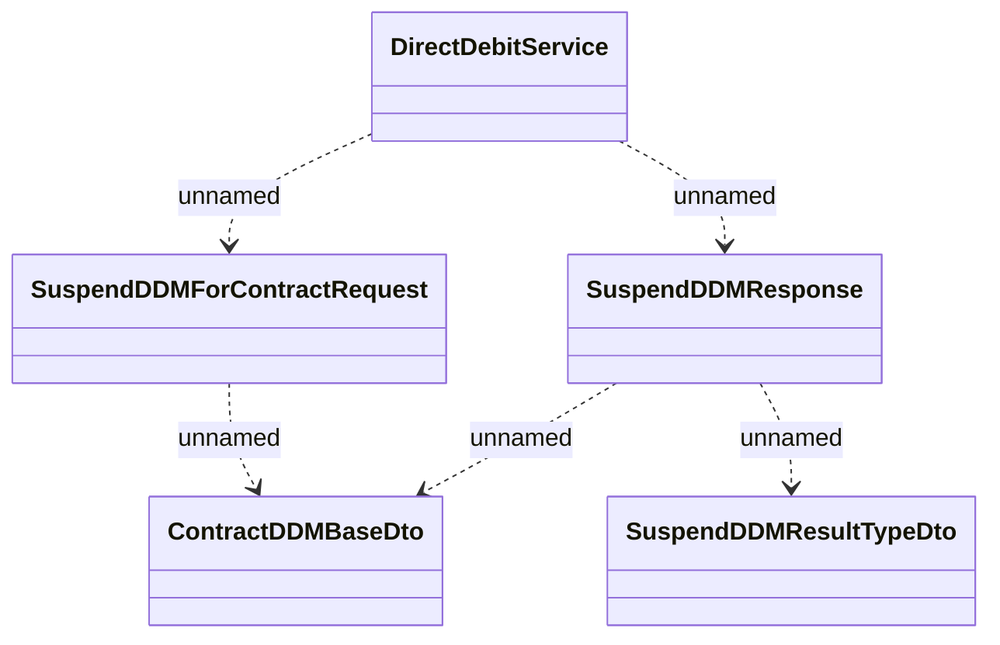

# DirectDebitService.suspendDDM

- **Diagram Type**: Logical
- **Package**: HomerSelect/BSL/Analysis Model/_Interface/Provided Web Services/Payments/DirectDebitService/suspendDDM
- **Diagram ID**: 112789
- **Elements**: 5
- **Connectors**: 5

