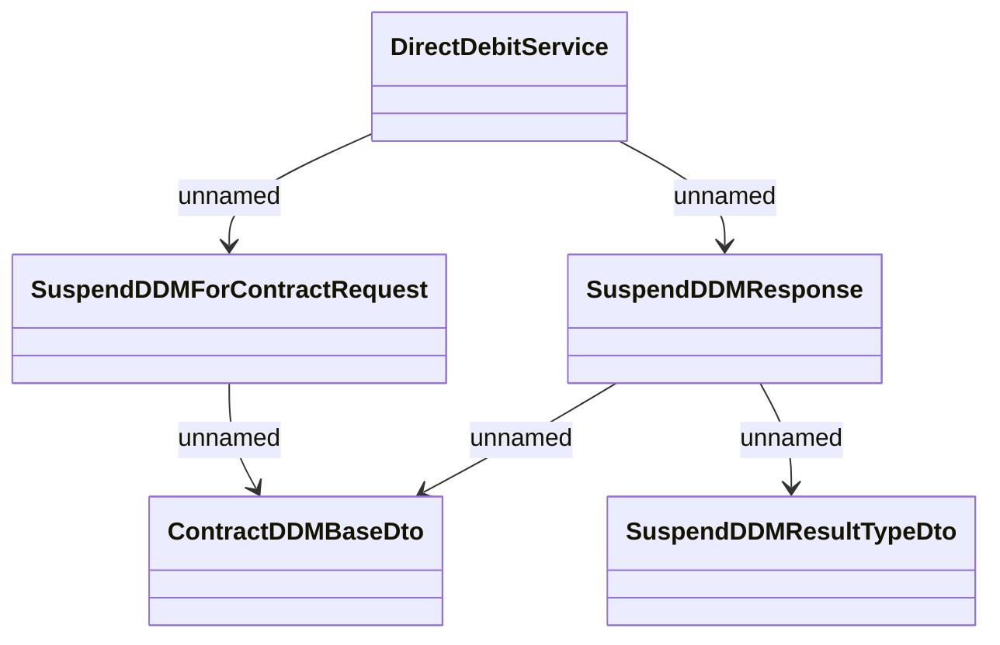

# DirectDebitService.suspendDDM

```mermaid
classDiagram
    class SuspendDDMResultTypeDto["SuspendDDMResultTypeDto"]
    class SuspendDDMResponse["SuspendDDMResponse"]
    class ContractDDMBaseDto["ContractDDMBaseDto"]
    class SuspendDDMForContractRequest["SuspendDDMForContractRequest"]
    class DirectDebitService["DirectDebitService"]
    SuspendDDMForContractRequest --> ContractDDMBaseDto : unnamed
    SuspendDDMResponse --> ContractDDMBaseDto : unnamed
    SuspendDDMResponse --> SuspendDDMResultTypeDto : unnamed
    DirectDebitService --> SuspendDDMForContractRequest : unnamed
    DirectDebitService --> SuspendDDMResponse : unnamed
```
