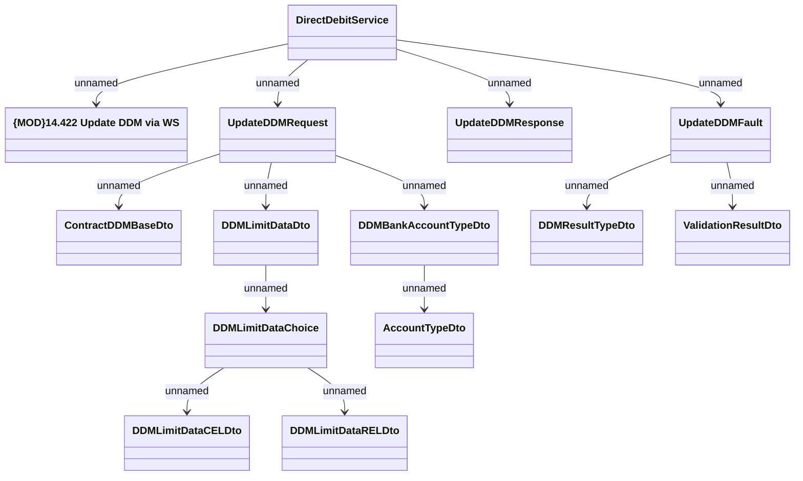

# DirectDebitService.updateDDM

```mermaid
classDiagram
    class ContractDDMBaseDto["ContractDDMBaseDto"]
    class DDMLimitDataChoice["DDMLimitDataChoice"]
    class DDMLimitDataRELDto["DDMLimitDataRELDto"]
    class DDMLimitDataDto["DDMLimitDataDto"]
    class DDMLimitDataCELDto["DDMLimitDataCELDto"]
    class DDMBankAccountTypeDto["DDMBankAccountTypeDto"]
    class DDMResultTypeDto["DDMResultTypeDto"]
    class MOD_14_422_Update_DDM_via_WS["{MOD}14.422 Update DDM via WS"]
    class ValidationResultDto["ValidationResultDto"]
    class UpdateDDMFault["UpdateDDMFault"]
    class UpdateDDMResponse["UpdateDDMResponse"]
    class AccountTypeDto["AccountTypeDto"]
    class UpdateDDMRequest["UpdateDDMRequest"]
    class DirectDebitService["DirectDebitService"]
    DirectDebitService --> MOD_14_422_Update_DDM_via_WS : unnamed
    DirectDebitService --> UpdateDDMFault : unnamed
    DirectDebitService --> UpdateDDMResponse : unnamed
    DirectDebitService --> UpdateDDMRequest : unnamed
    UpdateDDMRequest --> ContractDDMBaseDto : unnamed
    UpdateDDMRequest --> DDMLimitDataDto : unnamed
    UpdateDDMRequest --> DDMBankAccountTypeDto : unnamed
    UpdateDDMFault --> ValidationResultDto : unnamed
    UpdateDDMFault --> DDMResultTypeDto : unnamed
    DDMLimitDataChoice --> DDMLimitDataCELDto : unnamed
    DDMLimitDataChoice --> DDMLimitDataRELDto : unnamed
    DDMLimitDataDto --> DDMLimitDataChoice : unnamed
    DDMBankAccountTypeDto --> AccountTypeDto : unnamed
```
