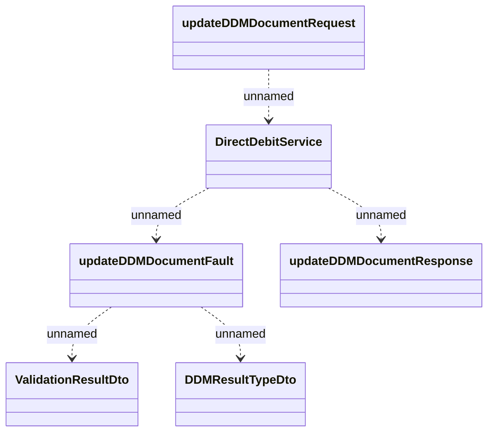

# directDebitService.updateDDMDocument

- **Diagram Type**: Logical
- **Package**: HomerSelect/BSL/Analysis Model/_Interface/Provided Web Services/Payments/DirectDebitService/updateDDMDocument
- **Diagram ID**: 126825
- **Elements**: 6
- **Connectors**: 5

