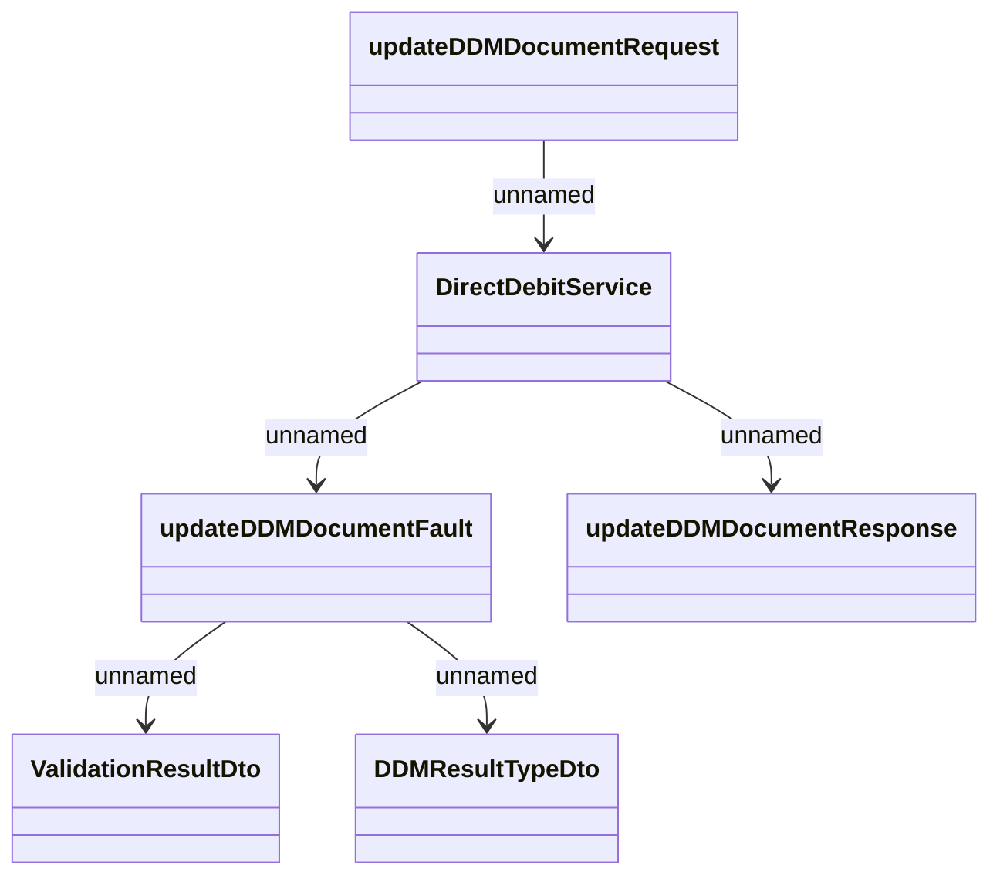

# directDebitService.updateDDMDocument

```mermaid
classDiagram
    class ValidationResultDto["ValidationResultDto"]
    class DDMResultTypeDto["DDMResultTypeDto"]
    class updateDDMDocumentFault["updateDDMDocumentFault"]
    class updateDDMDocumentResponse["updateDDMDocumentResponse"]
    class updateDDMDocumentRequest["updateDDMDocumentRequest"]
    class DirectDebitService["DirectDebitService"]
    updateDDMDocumentFault --> ValidationResultDto : unnamed
    updateDDMDocumentFault --> DDMResultTypeDto : unnamed
    updateDDMDocumentRequest --> DirectDebitService : unnamed
    DirectDebitService --> updateDDMDocumentFault : unnamed
    DirectDebitService --> updateDDMDocumentResponse : unnamed
```
