# IncomingPaymentModuleWS

- **Diagram Type**: Logical
- **Package**: HomerSelect/BSL/Analysis Model/_Interface/Provided Web Services/Payments/IncomingPaymentModuleWS
- **Diagram ID**: 162012
- **Elements**: 19
- **Connectors**: 26

```mermaid
classDiagram
    class Divide_incoming_payment_in_BSL[" Divide incoming payment in BSL"]
    class CreateIncomingPaymentResponse["CreateIncomingPaymentResponse"]
    class CreateIncomingPaymentRequest["CreateIncomingPaymentRequest"]
    class ComputeAmountToPairingResponse["ComputeAmountToPairingResponse"]
    class ComputeAmountToPairingRequest["ComputeAmountToPairingRequest"]
    class CoupleIncomingPaymentResponse["CoupleIncomingPaymentResponse"]
    class CoupleIncomingPaymentRequest["CoupleIncomingPaymentRequest"]
    class DivideIncomingPaymentResponse["DivideIncomingPaymentResponse"]
    class DivideIncomingPaymentRequest["DivideIncomingPaymentRequest"]
    class CreateDecoupledPaymentResponse["CreateDecoupledPaymentResponse"]
    class CreateDecoupledPaymentRequest["CreateDecoupledPaymentRequest"]
    class ValidateForDecoupleResponse["ValidateForDecoupleResponse"]
    class ValidateForDecoupleRequest["ValidateForDecoupleRequest"]
    class Process_cancel_incoming_payment_request["Process cancel incoming payment request"]
    class SourceSystemDto["SourceSystemDto"]
    class CancelIncomingPaymentResponse["CancelIncomingPaymentResponse"]
    class paymentToCancelDto["paymentToCancelDto"]
    class CancelIncomingPaymentRequest["CancelIncomingPaymentRequest"]
    class IncomingPaymentModuleWS["IncomingPaymentModuleWS"]
    IncomingPaymentModuleWS ..> Process_cancel_incoming_payment_request : unnamed
    IncomingPaymentModuleWS ..> CreateIncomingPaymentResponse : unnamed
    IncomingPaymentModuleWS ..> CreateIncomingPaymentRequest : unnamed
    IncomingPaymentModuleWS ..> ComputeAmountToPairingResponse : unnamed
    IncomingPaymentModuleWS ..> ComputeAmountToPairingRequest : unnamed
    IncomingPaymentModuleWS ..> CoupleIncomingPaymentResponse : unnamed
    IncomingPaymentModuleWS ..> CoupleIncomingPaymentRequest : unnamed
    IncomingPaymentModuleWS ..> DivideIncomingPaymentResponse : unnamed
    IncomingPaymentModuleWS ..> DivideIncomingPaymentRequest : unnamed
    IncomingPaymentModuleWS ..> CreateDecoupledPaymentResponse : unnamed
    IncomingPaymentModuleWS ..> CreateDecoupledPaymentRequest : unnamed
    IncomingPaymentModuleWS ..> Divide_incoming_payment_in_BSL : unnamed
    IncomingPaymentModuleWS ..> ValidateForDecoupleRequest : unnamed
    IncomingPaymentModuleWS ..> CancelIncomingPaymentRequest : unnamed
    paymentToCancelDto ..> SourceSystemDto : unnamed
    CoupleIncomingPaymentRequest ..> SourceSystemDto : unnamed
    DivideIncomingPaymentRequest ..> SourceSystemDto : unnamed
    CreateDecoupledPaymentRequest ..> SourceSystemDto : unnamed
    ValidateForDecoupleRequest ..> SourceSystemDto : unnamed
    paymentToCancelDto ..> SourceSystemDto : unnamed
    CreateIncomingPaymentRequest ..> SourceSystemDto : unnamed
    CreateDecoupledPaymentRequest ..> SourceSystemDto : unnamed
    DivideIncomingPaymentRequest ..> SourceSystemDto : unnamed
    IncomingPaymentModuleWS ..> CancelIncomingPaymentResponse : unnamed
    CancelIncomingPaymentRequest ..> paymentToCancelDto : unnamed
    IncomingPaymentModuleWS ..> ValidateForDecoupleResponse : unnamed
```

