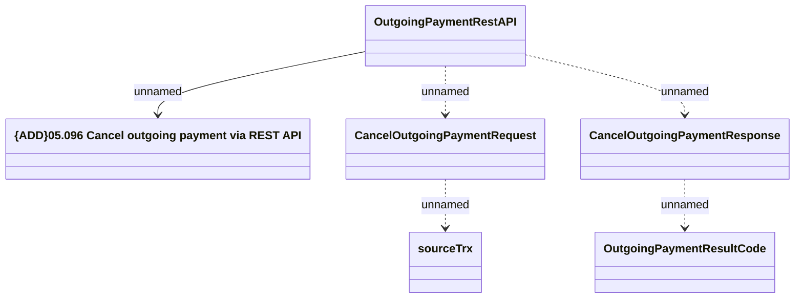

# OutgoingPaymentRestAPI - Cancel Outgoing Payment

- **Diagram Type**: Logical
- **Package**: HomerSelect/BSL/Analysis Model/_Interface/Provided Web Services/Payments/OutgoingPaymentRestAPI
- **Diagram ID**: 163417
- **Elements**: 6
- **Connectors**: 5

