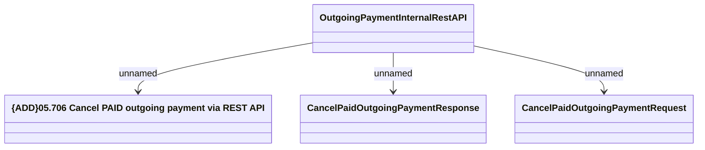

# OutgoingPaymentRestAPI - Cancel Paid Outgoing Payment

```mermaid
classDiagram
    class ADD_05_706_Cancel_PAID_outgoing_payment_via_REST_API["{ADD}05.706 Cancel PAID outgoing payment via REST API"]
    class CancelPaidOutgoingPaymentResponse["CancelPaidOutgoingPaymentResponse"]
    class CancelPaidOutgoingPaymentRequest["CancelPaidOutgoingPaymentRequest"]
    class OutgoingPaymentInternalRestAPI["OutgoingPaymentInternalRestAPI"]
    OutgoingPaymentInternalRestAPI --> ADD_05_706_Cancel_PAID_outgoing_payment_via_REST_API : unnamed
    OutgoingPaymentInternalRestAPI --> CancelPaidOutgoingPaymentResponse : unnamed
    OutgoingPaymentInternalRestAPI --> CancelPaidOutgoingPaymentRequest : unnamed
```
