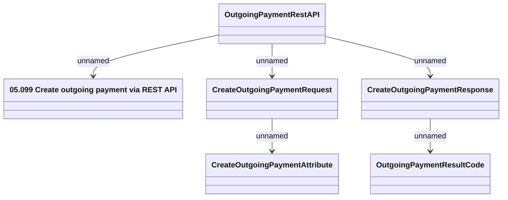

# OutgoingPaymentRestAPI - Create Outgoing Payment

```mermaid
classDiagram
    class n_05_099_Create_outgoing_payment_via_REST_API["05.099 Create outgoing payment via REST API"]
    class OutgoingPaymentResultCode["OutgoingPaymentResultCode"]
    class CreateOutgoingPaymentAttribute["CreateOutgoingPaymentAttribute"]
    class CreateOutgoingPaymentResponse["CreateOutgoingPaymentResponse"]
    class CreateOutgoingPaymentRequest["CreateOutgoingPaymentRequest"]
    class OutgoingPaymentRestAPI["OutgoingPaymentRestAPI"]
    OutgoingPaymentRestAPI --> CreateOutgoingPaymentRequest : unnamed
    OutgoingPaymentRestAPI --> CreateOutgoingPaymentResponse : unnamed
    CreateOutgoingPaymentRequest --> CreateOutgoingPaymentAttribute : unnamed
    CreateOutgoingPaymentResponse --> OutgoingPaymentResultCode : unnamed
    OutgoingPaymentRestAPI --> n_05_099_Create_outgoing_payment_via_REST_API : unnamed
```
