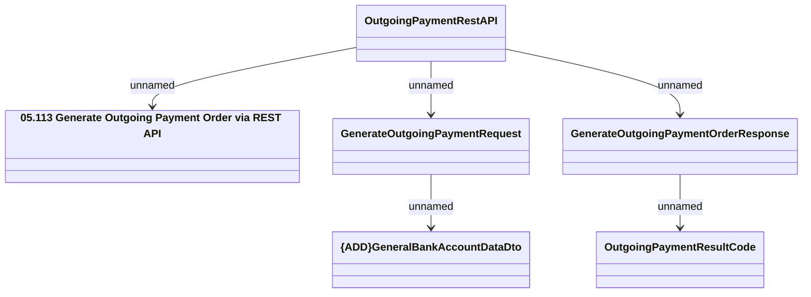

# OutgoingPaymentRestAPI - GenerateOutgoingPaymentOrder

```mermaid
classDiagram
    class OutgoingPaymentResultCode["OutgoingPaymentResultCode"]
    class n_05_113_Generate_Outgoing_Payment_Order_via_REST_API["05.113 Generate Outgoing Payment Order via REST API"]
    class GenerateOutgoingPaymentOrderResponse["GenerateOutgoingPaymentOrderResponse"]
    class ADD_GeneralBankAccountDataDto["{ADD}GeneralBankAccountDataDto"]
    class GenerateOutgoingPaymentRequest["GenerateOutgoingPaymentRequest"]
    class OutgoingPaymentRestAPI["OutgoingPaymentRestAPI"]
    OutgoingPaymentRestAPI --> GenerateOutgoingPaymentRequest : unnamed
    GenerateOutgoingPaymentRequest --> ADD_GeneralBankAccountDataDto : unnamed
    OutgoingPaymentRestAPI --> GenerateOutgoingPaymentOrderResponse : unnamed
    OutgoingPaymentRestAPI --> n_05_113_Generate_Outgoing_Payment_Order_via_REST_API : unnamed
    GenerateOutgoingPaymentOrderResponse --> OutgoingPaymentResultCode : unnamed
```
