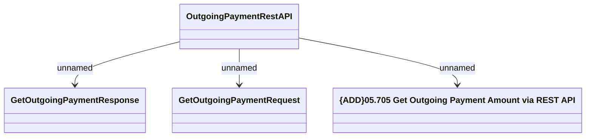

# OutgoingPaymentRestAPI - Get Otgoing Payment Amount

```mermaid
classDiagram
    class ADD_05_705_Get_Outgoing_Payment_Amount_via_REST_API["{ADD}05.705 Get Outgoing Payment Amount via REST API"]
    class GetOutgoingPaymentRequest["GetOutgoingPaymentRequest"]
    class GetOutgoingPaymentResponse["GetOutgoingPaymentResponse"]
    class OutgoingPaymentRestAPI["OutgoingPaymentRestAPI"]
    OutgoingPaymentRestAPI --> GetOutgoingPaymentResponse : unnamed
    OutgoingPaymentRestAPI --> GetOutgoingPaymentRequest : unnamed
    OutgoingPaymentRestAPI --> ADD_05_705_Get_Outgoing_Payment_Amount_via_REST_API : unnamed
```
