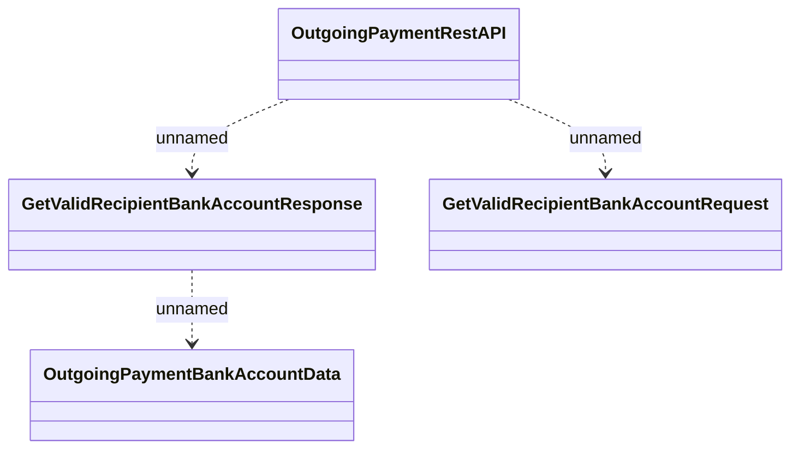

# OutgoingPaymentRestAPI - Get Valid Recipient Bank Account

- **Diagram Type**: Logical
- **Package**: HomerSelect/BSL/Analysis Model/_Interface/Provided Web Services/Payments/OutgoingPaymentRestAPI
- **Diagram ID**: 163416
- **Elements**: 4
- **Connectors**: 3

