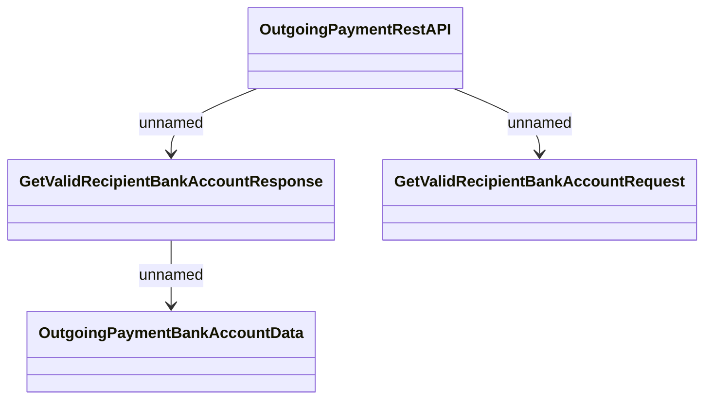

# OutgoingPaymentRestAPI - Get Valid Recipient Bank Account

```mermaid
classDiagram
    class OutgoingPaymentBankAccountData["OutgoingPaymentBankAccountData"]
    class GetValidRecipientBankAccountResponse["GetValidRecipientBankAccountResponse"]
    class GetValidRecipientBankAccountRequest["GetValidRecipientBankAccountRequest"]
    class OutgoingPaymentRestAPI["OutgoingPaymentRestAPI"]
    OutgoingPaymentRestAPI --> GetValidRecipientBankAccountRequest : unnamed
    OutgoingPaymentRestAPI --> GetValidRecipientBankAccountResponse : unnamed
    GetValidRecipientBankAccountResponse --> OutgoingPaymentBankAccountData : unnamed
```
