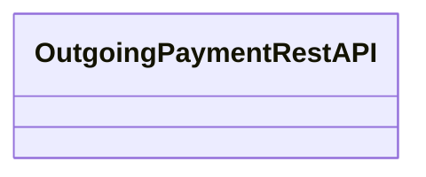

# OutgoingPaymentRestAPI

- **Diagram Type**: Logical
- **Package**: HomerSelect/BSL/Analysis Model/_Interface/Provided Web Services/Payments/OutgoingPaymentRestAPI
- **Diagram ID**: 163412
- **Elements**: 1
- **Connectors**: 0

