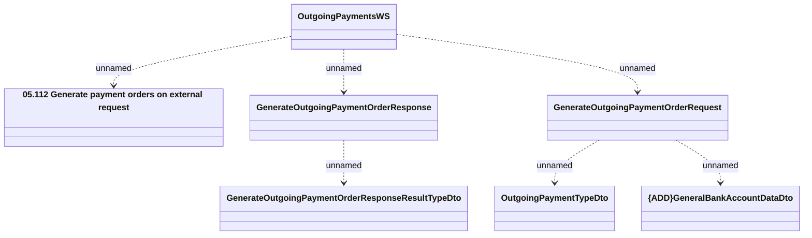

# OutgoingPaymentsWS - generateOutgoingPaymentOrder

- **Diagram Type**: Logical
- **Package**: HomerSelect/BSL/Analysis Model/_Interface/Provided Web Services/Payments/OutgoingPaymentsWS
- **Diagram ID**: 128367
- **Elements**: 7
- **Connectors**: 6

