# OutgoingPaymentsWS

- **Diagram Type**: Logical
- **Package**: HomerSelect/BSL/Analysis Model/_Interface/Provided Web Services/Payments/OutgoingPaymentsWS
- **Diagram ID**: 128366
- **Elements**: 20
- **Connectors**: 22

```mermaid
classDiagram
    class GenerateOutgoingPaymentOrderResponse["GenerateOutgoingPaymentOrderResponse"]
    class GenerateOutgoingPaymentOrderRequest["GenerateOutgoingPaymentOrderRequest"]
    class GenerateOutgoingPaymentOrderResponseResultTypeDto["GenerateOutgoingPaymentOrderResponseResultTypeDto"]
    class n_05_102_Browse_outgoing_payments_externally["05.102 Browse outgoing payments externally"]
    class GetOutgoingPaymentListResultTypeDto["GetOutgoingPaymentListResultTypeDto"]
    class GetOutgoingPaymentsByCriteriaResponse["GetOutgoingPaymentsByCriteriaResponse"]
    class GetOutgoingPaymentsByCriteriaRequest["GetOutgoingPaymentsByCriteriaRequest"]
    class CreateOutgoingPaymentAttributeDto["CreateOutgoingPaymentAttributeDto"]
    class MOD_05_098_Create_outgoing_payment_on_external_request["{MOD}05.098 Create outgoing payment on external request"]
    class ADD_CreateOutgoingPaymentResultTypeDto["{ADD}CreateOutgoingPaymentResultTypeDto"]
    class ADD_CreateOutgoingPaymentResponse["{ADD}CreateOutgoingPaymentResponse"]
    class ADD_CreateOutgoingPaymentRequest["{ADD}CreateOutgoingPaymentRequest"]
    class OutgoingPaymentTypeDto["OutgoingPaymentTypeDto"]
    class OutgoingPaymentStatusTypeDto["OutgoingPaymentStatusTypeDto"]
    class SimpleOutgoingPaymentDto["SimpleOutgoingPaymentDto"]
    class n_05_702_Get_outgoing_payments_for_contract_service["05.702 Get outgoing payments for contract - service"]
    class GetOutgoingPaymentsForContractResultTypeDto["GetOutgoingPaymentsForContractResultTypeDto"]
    class GetOutgoingPaymentsForContractResponse["GetOutgoingPaymentsForContractResponse"]
    class GetOutgoingPaymentsForContractRequest["GetOutgoingPaymentsForContractRequest"]
    class OutgoingPaymentsWS["OutgoingPaymentsWS"]
    OutgoingPaymentsWS ..> MOD_05_098_Create_outgoing_payment_on_external_request : unnamed
    OutgoingPaymentsWS ..> GenerateOutgoingPaymentOrderResponse : unnamed
    OutgoingPaymentsWS ..> ADD_CreateOutgoingPaymentResponse : unnamed
    OutgoingPaymentsWS ..> n_05_102_Browse_outgoing_payments_externally : unnamed
    OutgoingPaymentsWS ..> ADD_CreateOutgoingPaymentRequest : unnamed
    OutgoingPaymentsWS ..> n_05_702_Get_outgoing_payments_for_contract_service : unnamed
    OutgoingPaymentsWS ..> GetOutgoingPaymentsByCriteriaResponse : unnamed
    OutgoingPaymentsWS ..> GetOutgoingPaymentsForContractRequest : unnamed
    OutgoingPaymentsWS ..> GetOutgoingPaymentsByCriteriaRequest : unnamed
    OutgoingPaymentsWS ..> GetOutgoingPaymentsForContractResponse : unnamed
    OutgoingPaymentsWS ..> GenerateOutgoingPaymentOrderRequest : unnamed
    GenerateOutgoingPaymentOrderRequest --> SimpleOutgoingPaymentDto : unnamed
    GenerateOutgoingPaymentOrderRequest ..> OutgoingPaymentTypeDto : unnamed
    GenerateOutgoingPaymentOrderResponse ..> GenerateOutgoingPaymentOrderResponseResultTypeDto : unnamed
    ADD_CreateOutgoingPaymentRequest ..> OutgoingPaymentTypeDto : unnamed
    ADD_CreateOutgoingPaymentRequest ..> CreateOutgoingPaymentAttributeDto : unnamed
    GetOutgoingPaymentsForContractResponse ..> SimpleOutgoingPaymentDto : unnamed
    GetOutgoingPaymentsForContractResponse ..> GetOutgoingPaymentsForContractResultTypeDto : unnamed
    GetOutgoingPaymentsByCriteriaResponse --> GetOutgoingPaymentListResultTypeDto : unnamed
    ADD_CreateOutgoingPaymentResponse ..> ADD_CreateOutgoingPaymentResultTypeDto : unnamed
    SimpleOutgoingPaymentDto ..> OutgoingPaymentTypeDto : unnamed
    SimpleOutgoingPaymentDto ..> OutgoingPaymentStatusTypeDto : unnamed
```

