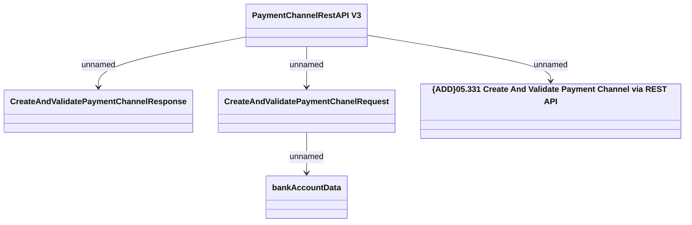

# PaymentChannelRestAPI - Create And Validate Payment Channel

```mermaid
classDiagram
    class bankAccountData["bankAccountData"]
    class CreateAndValidatePaymentChannelResponse["CreateAndValidatePaymentChannelResponse"]
    class CreateAndValidatePaymentChanelRequest["CreateAndValidatePaymentChanelRequest"]
    class PaymentChannelRestAPI_V3["PaymentChannelRestAPI V3"]
    class ADD_05_331_Create_And_Validate_Payment_Channel_via_REST_API["{ADD}05.331 Create And Validate Payment Channel via REST API"]
    PaymentChannelRestAPI_V3 --> CreateAndValidatePaymentChannelResponse : unnamed
    PaymentChannelRestAPI_V3 --> CreateAndValidatePaymentChanelRequest : unnamed
    PaymentChannelRestAPI_V3 --> ADD_05_331_Create_And_Validate_Payment_Channel_via_REST_API : unnamed
    CreateAndValidatePaymentChanelRequest --> bankAccountData : unnamed
```
