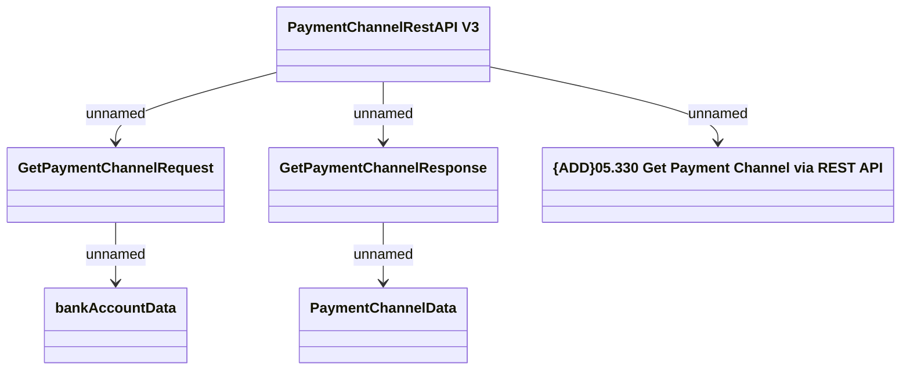

# PaymentChannelRestAPI - Get Payment Channel

```mermaid
classDiagram
    class PaymentChannelData["PaymentChannelData"]
    class bankAccountData["bankAccountData"]
    class GetPaymentChannelResponse["GetPaymentChannelResponse"]
    class GetPaymentChannelRequest["GetPaymentChannelRequest"]
    class PaymentChannelRestAPI_V3["PaymentChannelRestAPI V3"]
    class ADD_05_330_Get_Payment_Channel_via_REST_API["{ADD}05.330 Get Payment Channel via REST API"]
    PaymentChannelRestAPI_V3 --> ADD_05_330_Get_Payment_Channel_via_REST_API : unnamed
    PaymentChannelRestAPI_V3 --> GetPaymentChannelRequest : unnamed
    PaymentChannelRestAPI_V3 --> GetPaymentChannelResponse : unnamed
    GetPaymentChannelRequest --> bankAccountData : unnamed
    GetPaymentChannelResponse --> PaymentChannelData : unnamed
```
