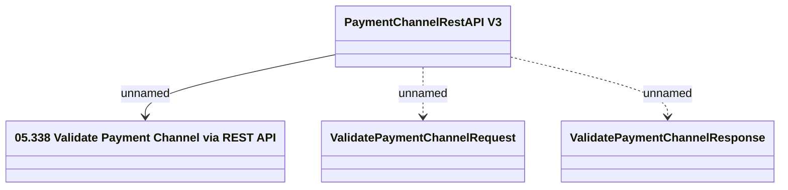

# PaymentChannelRestAPI - Validate Payment Channel

- **Diagram Type**: Logical
- **Package**: HomerSelect/BSL/Analysis Model/_Interface/Provided Web Services/Payments/PaymentChannelRestAPI/PaymentChannelRestAPI v3
- **Diagram ID**: 153955
- **Elements**: 4
- **Connectors**: 3

