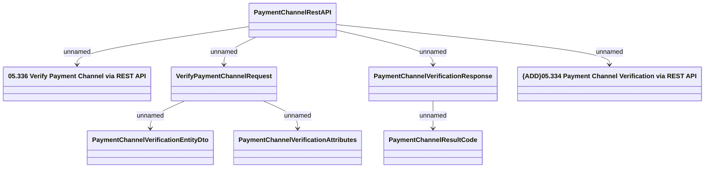

# PaymentChannelRestAPI - Verify Payment Channel

```mermaid
classDiagram
    class PaymentChannelResultCode["PaymentChannelResultCode"]
    class PaymentChannelVerificationEntityDto["PaymentChannelVerificationEntityDto"]
    class n_05_336_Verify_Payment_Channel_via_REST_API["05.336 Verify Payment Channel via REST API"]
    class PaymentChannelVerificationAttributes["PaymentChannelVerificationAttributes"]
    class PaymentChannelVerificationResponse["PaymentChannelVerificationResponse"]
    class VerifyPaymentChannelRequest["VerifyPaymentChannelRequest"]
    class ADD_05_334_Payment_Channel_Verification_via_REST_API["{ADD}05.334 Payment Channel Verification via REST API"]
    class PaymentChannelRestAPI["PaymentChannelRestAPI"]
    PaymentChannelRestAPI --> VerifyPaymentChannelRequest : unnamed
    PaymentChannelRestAPI --> PaymentChannelVerificationResponse : unnamed
    PaymentChannelRestAPI --> n_05_336_Verify_Payment_Channel_via_REST_API : unnamed
    PaymentChannelRestAPI --> ADD_05_334_Payment_Channel_Verification_via_REST_API : unnamed
    VerifyPaymentChannelRequest --> PaymentChannelVerificationEntityDto : unnamed
    VerifyPaymentChannelRequest --> PaymentChannelVerificationAttributes : unnamed
    PaymentChannelVerificationResponse --> PaymentChannelResultCode : unnamed
```
