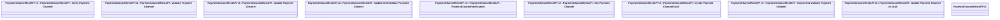

# PaymentChannelRestAPI

```mermaid
classDiagram
    class PaymentChannelRestAPI_v3_PaymentChannelRestAPI_Verify_Paymen["PaymentChannelRestAPI v3 : PaymentChannelRestAPI - Verify Payment Channel"]
    class PaymentChannelRestAPI_v3_PaymentChannelRestAPI_Validate_Paym["PaymentChannelRestAPI v3 : PaymentChannelRestAPI - Validate Payment Channel"]
    class PaymentChannelRestAPI_v3_PaymentChannelRestAPI_Update_Paymen["PaymentChannelRestAPI v3 : PaymentChannelRestAPI - Update Payment Channel"]
    class PaymentChannelRestAPI_v3_PaymentChannelRestAPI_Update_And_Va["PaymentChannelRestAPI v3 : PaymentChannelRestAPI - Update And Validate Payment Channel"]
    class PaymentChannelRestAPI_v3_PaymentChannelRestAPI_PaymentChanne["PaymentChannelRestAPI v3 : PaymentChannelRestAPI - PaymentChannelVerification"]
    class PaymentChannelRestAPI_v3_PaymentChannelRestAPI_Get_Payment_C["PaymentChannelRestAPI v3 : PaymentChannelRestAPI - Get Payment Channel"]
    class PaymentChannelRestAPI_v3_PaymentChannelRestAPI_Create_Paymen["PaymentChannelRestAPI v3 : PaymentChannelRestAPI - Create Payment Channel Draft"]
    class PaymentChannelRestAPI_v3_PaymentChannelRestAPI_Create_And_Va["PaymentChannelRestAPI v3 : PaymentChannelRestAPI - Create And Validate Payment Channel"]
    class PaymentChannelRestAPI_v3_PaymentChanenlRestAPI_Update_Paymen["PaymentChannelRestAPI v3 : PaymentChanenlRestAPI - Update Payment Channel or Draft"]
    class PaymentChannelRestAPI_V3["PaymentChannelRestAPI V3"]
```
