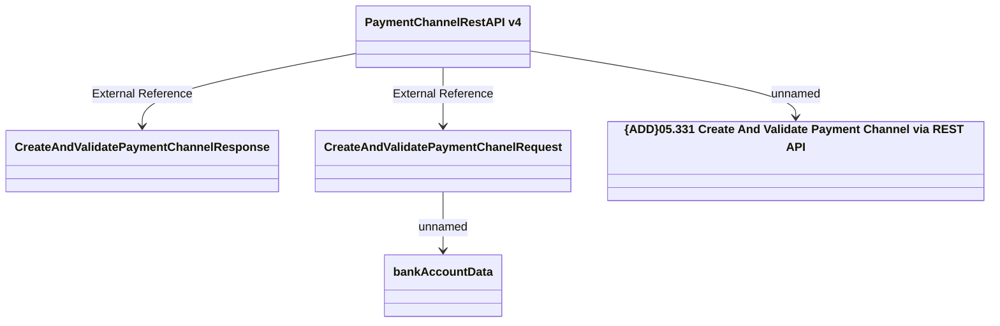

# PaymentChannelRestAPI - Create and Validate Payment Channel

```mermaid
classDiagram
    class CreateAndValidatePaymentChannelResponse["CreateAndValidatePaymentChannelResponse"]
    class bankAccountData["bankAccountData"]
    class CreateAndValidatePaymentChanelRequest["CreateAndValidatePaymentChanelRequest"]
    class ADD_05_331_Create_And_Validate_Payment_Channel_via_REST_API["{ADD}05.331 Create And Validate Payment Channel via REST API"]
    class PaymentChannelRestAPI_v4["PaymentChannelRestAPI v4"]
    PaymentChannelRestAPI_v4 --> CreateAndValidatePaymentChannelResponse : External Reference
    PaymentChannelRestAPI_v4 --> CreateAndValidatePaymentChanelRequest : External Reference
    PaymentChannelRestAPI_v4 --> ADD_05_331_Create_And_Validate_Payment_Channel_via_REST_API : unnamed
    CreateAndValidatePaymentChanelRequest --> bankAccountData : unnamed
```
