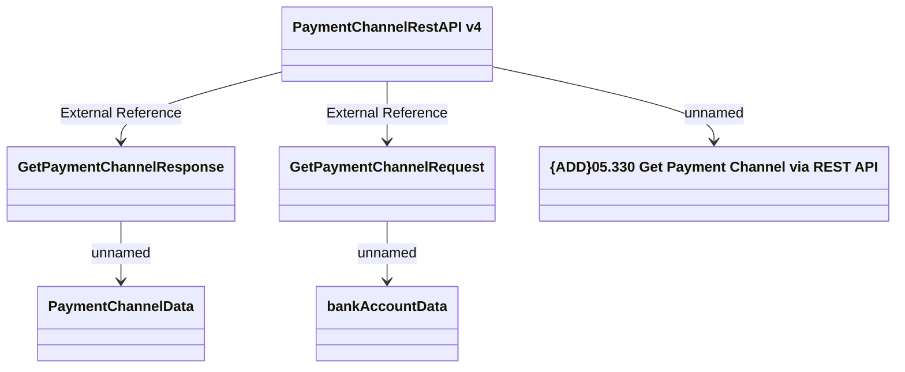

# PaymentChannelRestAPI - Get Payment Channel

```mermaid
classDiagram
    class PaymentChannelData["PaymentChannelData"]
    class GetPaymentChannelResponse["GetPaymentChannelResponse"]
    class bankAccountData["bankAccountData"]
    class GetPaymentChannelRequest["GetPaymentChannelRequest"]
    class ADD_05_330_Get_Payment_Channel_via_REST_API["{ADD}05.330 Get Payment Channel via REST API"]
    class PaymentChannelRestAPI_v4["PaymentChannelRestAPI v4"]
    PaymentChannelRestAPI_v4 --> GetPaymentChannelResponse : External Reference
    PaymentChannelRestAPI_v4 --> GetPaymentChannelRequest : External Reference
    PaymentChannelRestAPI_v4 --> ADD_05_330_Get_Payment_Channel_via_REST_API : unnamed
    GetPaymentChannelRequest --> bankAccountData : unnamed
    GetPaymentChannelResponse --> PaymentChannelData : unnamed
```
