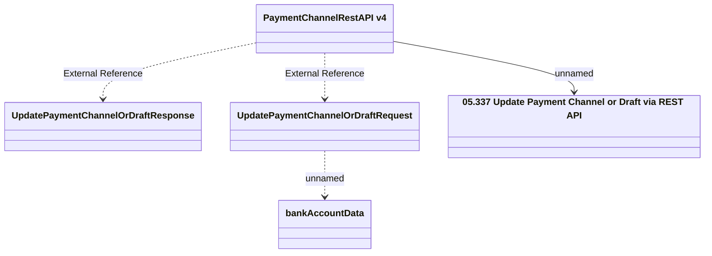

# PaymentChannelRestAPI - Update Payment Channel or Draft

- **Diagram Type**: Logical
- **Package**: HomerSelect/BSL/Analysis Model/_Interface/Provided Web Services/Payments/PaymentChannelRestAPI/PaymentChannelRestAPI v4
- **Diagram ID**: 153969
- **Elements**: 5
- **Connectors**: 4

