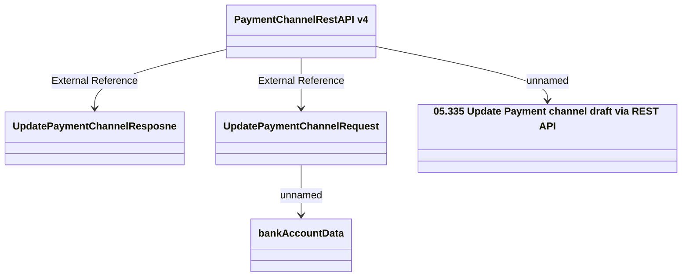

# PaymentChannelRestAPI - Update Payment Channel

```mermaid
classDiagram
    class UpdatePaymentChannelResposne["UpdatePaymentChannelResposne"]
    class bankAccountData["bankAccountData"]
    class UpdatePaymentChannelRequest["UpdatePaymentChannelRequest"]
    class n_05_335_Update_Payment_channel_draft_via_REST_API["05.335 Update Payment channel draft via REST API"]
    class PaymentChannelRestAPI_v4["PaymentChannelRestAPI v4"]
    PaymentChannelRestAPI_v4 --> UpdatePaymentChannelResposne : External Reference
    PaymentChannelRestAPI_v4 --> UpdatePaymentChannelRequest : External Reference
    PaymentChannelRestAPI_v4 --> n_05_335_Update_Payment_channel_draft_via_REST_API : unnamed
    UpdatePaymentChannelRequest --> bankAccountData : unnamed
```
