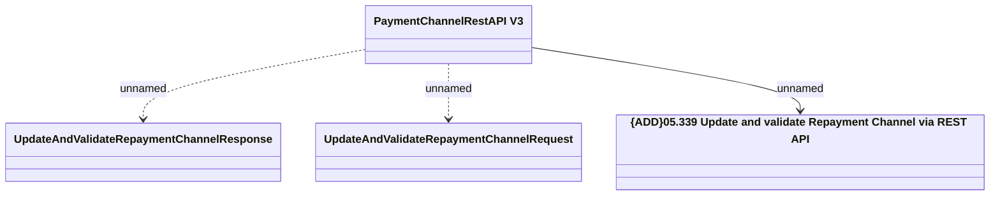

# PaymentChannelRestAPI v3 - Update and validate repayment channel via REST API

- **Diagram Type**: Logical
- **Package**: HomerSelect/BSL/Analysis Model/_Interface/Provided Web Services/Payments/PaymentChannelRestAPI/PaymentChannelRestAPI v4
- **Diagram ID**: 153974
- **Elements**: 4
- **Connectors**: 3

