# PaymentChannelRestAPI

- **Diagram Type**: Logical
- **Package**: HomerSelect/BSL/Analysis Model/_Interface/Provided Web Services/Payments/PaymentChannelRestAPI/PaymentChannelRestAPI v4
- **Diagram ID**: 153965
- **Elements**: 10
- **Connectors**: 9

```mermaid
classDiagram
    class PaymentChannelRestAPI_v4_PaymentChannelRestAPI_v3_Update_and["PaymentChannelRestAPI v4 : PaymentChannelRestAPI v3 - Update and validate repayment channel via REST API"]
    class PaymentChannelRestAPI_v4_PaymentChannelRestAPI_Verify_Paymen["PaymentChannelRestAPI v4 : PaymentChannelRestAPI - Verify Payment Channel"]
    class PaymentChannelRestAPI_v4_PaymentChannelRestAPI_Validate_Paym["PaymentChannelRestAPI v4 : PaymentChannelRestAPI - Validate Payment Channel"]
    class PaymentChannelRestAPI_v4_PaymentChannelRestAPI_Update_Paymen["PaymentChannelRestAPI v4 : PaymentChannelRestAPI - Update Payment Channel or Draft"]
    class PaymentChannelRestAPI_v4_PaymentChannelRestAPI_Update_Paymen["PaymentChannelRestAPI v4 : PaymentChannelRestAPI - Update Payment Channel"]
    class PaymentChannelRestAPI_v4_PaymentChannelRestAPI_Update_and_Va["PaymentChannelRestAPI v4 : PaymentChannelRestAPI - Update and Validate Payment Channel"]
    class PaymentChannelRestAPI_v4_PaymentChannelRestAPI_Get_Payment_C["PaymentChannelRestAPI v4 : PaymentChannelRestAPI - Get Payment Channel"]
    class PaymentChannelRestAPI_v4_PaymentChannelRestAPI_Create_Paymen["PaymentChannelRestAPI v4 : PaymentChannelRestAPI - Create Payment Channel Draft"]
    class PaymentChannelRestAPI_v4_PaymentChannelRestAPI_Create_and_Va["PaymentChannelRestAPI v4 : PaymentChannelRestAPI - Create and Validate Payment Channel"]
    class PaymentChannelRestAPI_v4["PaymentChannelRestAPI v4"]
    PaymentChannelRestAPI_v4 --> PaymentChannelRestAPI_v4_PaymentChannelRestAPI_v3_Update_and : unnamed
    PaymentChannelRestAPI_v4 --> PaymentChannelRestAPI_v4_PaymentChannelRestAPI_Verify_Paymen : unnamed
    PaymentChannelRestAPI_v4 --> PaymentChannelRestAPI_v4_PaymentChannelRestAPI_Validate_Paym : unnamed
    PaymentChannelRestAPI_v4 --> PaymentChannelRestAPI_v4_PaymentChannelRestAPI_Update_and_Va : unnamed
    PaymentChannelRestAPI_v4 --> PaymentChannelRestAPI_v4_PaymentChannelRestAPI_Create_Paymen : unnamed
    PaymentChannelRestAPI_v4 --> PaymentChannelRestAPI_v4_PaymentChannelRestAPI_Create_and_Va : unnamed
    PaymentChannelRestAPI_v4 --> PaymentChannelRestAPI_v4_PaymentChannelRestAPI_Update_Paymen : unnamed
    PaymentChannelRestAPI_v4 --> PaymentChannelRestAPI_v4_PaymentChannelRestAPI_Update_Paymen : unnamed
    PaymentChannelRestAPI_v4 --> PaymentChannelRestAPI_v4_PaymentChannelRestAPI_Get_Payment_C : unnamed
```

