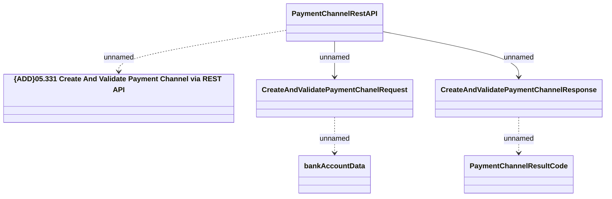

# PaymentChannelRestAPI - Create And Validate Payment Channel

- **Diagram Type**: Logical
- **Package**: HomerSelect/BSL/Analysis Model/_Interface/Provided Web Services/Payments/PaymentChannelRestAPI/PaymentChannelRestAPI
- **Diagram ID**: 153772
- **Elements**: 6
- **Connectors**: 5

