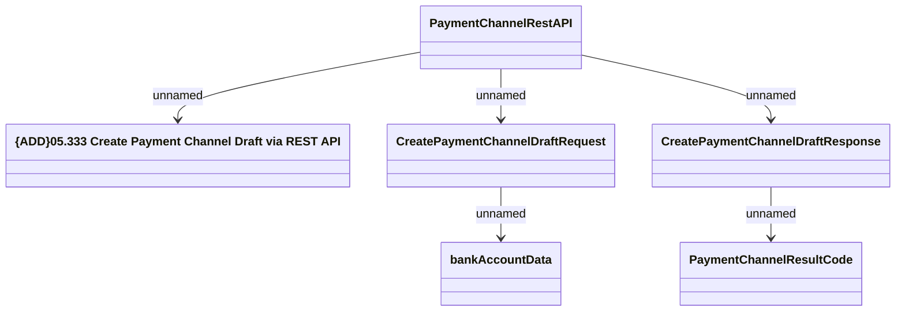

# PaymentChannelRestAPI - Create Payment Channel Draft

```mermaid
classDiagram
    class ADD_05_333_Create_Payment_Channel_Draft_via_REST_API["{ADD}05.333 Create Payment Channel Draft via REST API"]
    class PaymentChannelResultCode["PaymentChannelResultCode"]
    class bankAccountData["bankAccountData"]
    class CreatePaymentChannelDraftResponse["CreatePaymentChannelDraftResponse"]
    class CreatePaymentChannelDraftRequest["CreatePaymentChannelDraftRequest"]
    class PaymentChannelRestAPI["PaymentChannelRestAPI"]
    PaymentChannelRestAPI --> ADD_05_333_Create_Payment_Channel_Draft_via_REST_API : unnamed
    PaymentChannelRestAPI --> CreatePaymentChannelDraftRequest : unnamed
    PaymentChannelRestAPI --> CreatePaymentChannelDraftResponse : unnamed
    CreatePaymentChannelDraftRequest --> bankAccountData : unnamed
    CreatePaymentChannelDraftResponse --> PaymentChannelResultCode : unnamed
```
