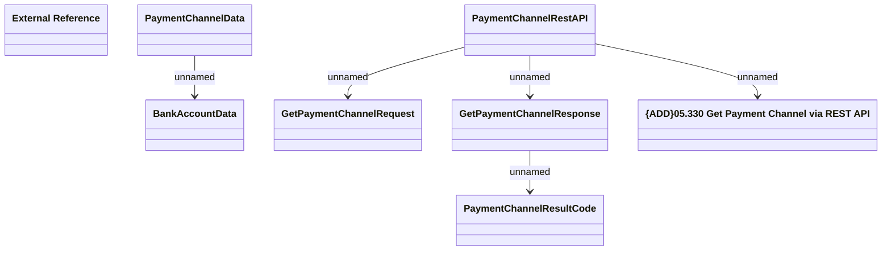

# PaymentChannelRestAPI - Get Payment Channel

```mermaid
classDiagram
    class PaymentChannelResultCode["PaymentChannelResultCode"]
    class ADD_05_330_Get_Payment_Channel_via_REST_API["{ADD}05.330 Get Payment Channel via REST API"]
    class External_Reference["External Reference"]
    class BankAccountData["BankAccountData"]
    class PaymentChannelData["PaymentChannelData"]
    class GetPaymentChannelResponse["GetPaymentChannelResponse"]
    class GetPaymentChannelRequest["GetPaymentChannelRequest"]
    class PaymentChannelRestAPI["PaymentChannelRestAPI"]
    PaymentChannelRestAPI --> GetPaymentChannelRequest : unnamed
    PaymentChannelRestAPI --> GetPaymentChannelResponse : unnamed
    PaymentChannelRestAPI --> ADD_05_330_Get_Payment_Channel_via_REST_API : unnamed
    GetPaymentChannelResponse --> PaymentChannelResultCode : unnamed
    PaymentChannelData --> BankAccountData : unnamed
```
