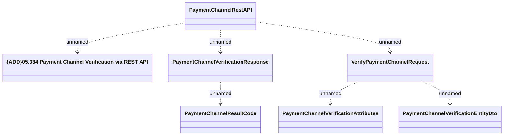

# PaymentChannelRestAPI - PaymentChannelVerification

- **Diagram Type**: Logical
- **Package**: HomerSelect/BSL/Analysis Model/_Interface/Provided Web Services/Payments/PaymentChannelRestAPI/PaymentChannelRestAPI
- **Diagram ID**: 153776
- **Elements**: 7
- **Connectors**: 6

