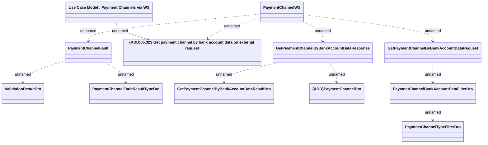

# PaymentChannelWS - get payment channels by bank account data

- **Diagram Type**: Logical
- **Package**: HomerSelect/BSL/Analysis Model/_Interface/Provided Web Services/Payments/PaymentChannelWS
- **Diagram ID**: 125777
- **Elements**: 12
- **Connectors**: 11

