# PaymentChannelWS

- **Diagram Type**: Logical
- **Package**: HomerSelect/BSL/Analysis Model/_Interface/Provided Web Services/Payments/PaymentChannelWS
- **Diagram ID**: 125776
- **Elements**: 24
- **Connectors**: 20

```mermaid
classDiagram
    class ADD_GeneralBankAccountDataDto["{ADD}GeneralBankAccountDataDto"]
    class BankAccountDto["BankAccountDto"]
    class n_05_322_Get_payment_channel_on_external_request["05.322 Get payment channel on external request"]
    class ADD_PaymentChannelDto["{ADD}PaymentChannelDto"]
    class ADD_GetPaymentChannelResponse["{ADD}GetPaymentChannelResponse"]
    class ADD_GetPaymentChannelRequest["{ADD}GetPaymentChannelRequest"]
    class MOD_05_321_Update_payment_channel_on_external_request["{MOD}05.321 Update payment channel on external request"]
    class ADD_UpdatePaymentChannelResponse["{ADD}UpdatePaymentChannelResponse"]
    class ADD_UpdatePaymentChannelRequest["{ADD}UpdatePaymentChannelRequest"]
    class MOD_05_320_Create_payment_channel_on_external_request["{MOD}05.320 Create payment channel on external request"]
    class PaymentChannelResponseResult["PaymentChannelResponseResult"]
    class ADD_CreatePaymentChannelResponse["{ADD}CreatePaymentChannelResponse"]
    class ADD_PaymentPurposeTypeDto["{ADD}PaymentPurposeTypeDto"]
    class ADD_CreatePaymentChannelRequest["{ADD}CreatePaymentChannelRequest"]
    class DDMResultTypeDto["DDMResultTypeDto"]
    class ValidationResultDto["ValidationResultDto"]
    class ContractStatusType["ContractStatusType"]
    class ChangeRepaymentChannelFault["ChangeRepaymentChannelFault"]
    class n_14_661_Change_repayment_channel_via_WS["14.661 Change repayment channel via WS"]
    class RepaymentChannelTypeDto["RepaymentChannelTypeDto"]
    class ContractDDMBaseDto["ContractDDMBaseDto"]
    class ChangeRepaymentChannelResponse["ChangeRepaymentChannelResponse"]
    class ChangeRepaymentChannelRequest["ChangeRepaymentChannelRequest"]
    class PaymentChannelWS["PaymentChannelWS"]
    ADD_GetPaymentChannelResponse ..> ADD_PaymentChannelDto : unnamed
    ADD_GetPaymentChannelResponse ..> BankAccountDto : unnamed
    ADD_UpdatePaymentChannelResponse ..> PaymentChannelResponseResult : unnamed
    ADD_UpdatePaymentChannelRequest ..> ADD_GeneralBankAccountDataDto : unnamed
    ADD_CreatePaymentChannelResponse ..> PaymentChannelResponseResult : unnamed
    ADD_CreatePaymentChannelRequest ..> ADD_GeneralBankAccountDataDto : unnamed
    ADD_CreatePaymentChannelRequest ..> ADD_PaymentPurposeTypeDto : unnamed
    ADD_GetPaymentChannelResponse ..> PaymentChannelResponseResult : unnamed
    ChangeRepaymentChannelFault ..> DDMResultTypeDto : unnamed
    PaymentChannelWS ..> ChangeRepaymentChannelRequest : unnamed
    ChangeRepaymentChannelRequest ..> RepaymentChannelTypeDto : unnamed
    ChangeRepaymentChannelRequest ..> ContractStatusType : unnamed
    ChangeRepaymentChannelRequest ..> ContractDDMBaseDto : unnamed
    PaymentChannelWS ..> ADD_UpdatePaymentChannelRequest : unnamed
    PaymentChannelWS ..> ADD_GetPaymentChannelResponse : unnamed
    PaymentChannelWS ..> ADD_UpdatePaymentChannelResponse : unnamed
    PaymentChannelWS ..> ADD_GetPaymentChannelRequest : unnamed
    PaymentChannelWS ..> MOD_05_321_Update_payment_channel_on_external_request : unnamed
    ChangeRepaymentChannelFault ..> ValidationResultDto : unnamed
    ContractDDMBaseDto ..> ContractStatusType : unnamed
```

