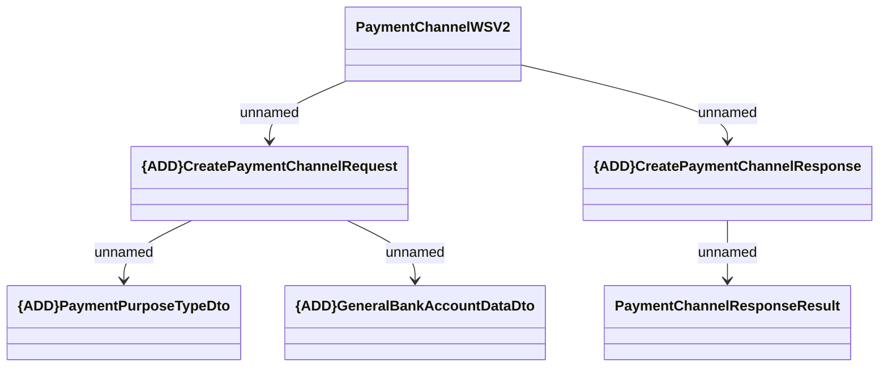

# PaymentChannelWSV2 - Create Payment Channel

```mermaid
classDiagram
    class PaymentChannelResponseResult["PaymentChannelResponseResult"]
    class ADD_CreatePaymentChannelResponse["{ADD}CreatePaymentChannelResponse"]
    class ADD_GeneralBankAccountDataDto["{ADD}GeneralBankAccountDataDto"]
    class ADD_PaymentPurposeTypeDto["{ADD}PaymentPurposeTypeDto"]
    class ADD_CreatePaymentChannelRequest["{ADD}CreatePaymentChannelRequest"]
    class PaymentChannelWSV2["PaymentChannelWSV2"]
    PaymentChannelWSV2 --> ADD_CreatePaymentChannelRequest : unnamed
    PaymentChannelWSV2 --> ADD_CreatePaymentChannelResponse : unnamed
    ADD_CreatePaymentChannelRequest --> ADD_PaymentPurposeTypeDto : unnamed
    ADD_CreatePaymentChannelRequest --> ADD_GeneralBankAccountDataDto : unnamed
    ADD_CreatePaymentChannelResponse --> PaymentChannelResponseResult : unnamed
```
