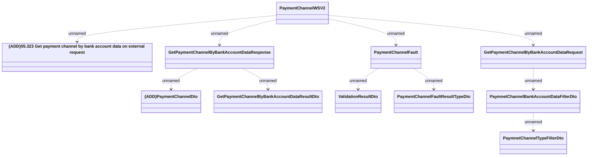

# PaymentChannelWSV2 - Get Payment Channel By Bank Account

- **Diagram Type**: Logical
- **Package**: HomerSelect/BSL/Analysis Model/_Interface/Provided Web Services/Payments/PaymentChannelWS/PaymentChannelWSV2
- **Diagram ID**: 125774
- **Elements**: 11
- **Connectors**: 10

