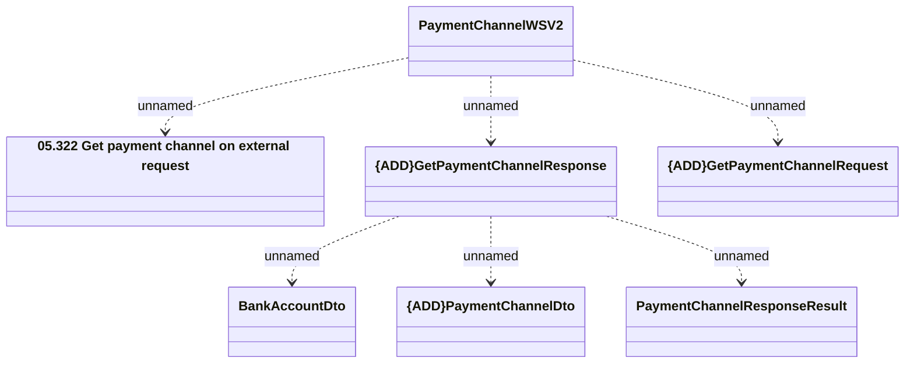

# PaymentChannelWSV2 - Get Payment Channel

- **Diagram Type**: Logical
- **Package**: HomerSelect/BSL/Analysis Model/_Interface/Provided Web Services/Payments/PaymentChannelWS/PaymentChannelWSV2
- **Diagram ID**: 125773
- **Elements**: 7
- **Connectors**: 6

