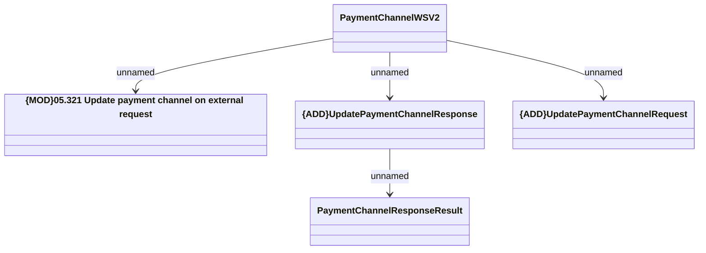

# PaymentChannelWSV2 - Update Payment Channel

```mermaid
classDiagram
    class MOD_05_321_Update_payment_channel_on_external_request["{MOD}05.321 Update payment channel on external request"]
    class PaymentChannelResponseResult["PaymentChannelResponseResult"]
    class ADD_UpdatePaymentChannelResponse["{ADD}UpdatePaymentChannelResponse"]
    class ADD_UpdatePaymentChannelRequest["{ADD}UpdatePaymentChannelRequest"]
    class PaymentChannelWSV2["PaymentChannelWSV2"]
    PaymentChannelWSV2 --> ADD_UpdatePaymentChannelRequest : unnamed
    PaymentChannelWSV2 --> ADD_UpdatePaymentChannelResponse : unnamed
    PaymentChannelWSV2 --> MOD_05_321_Update_payment_channel_on_external_request : unnamed
    ADD_UpdatePaymentChannelResponse --> PaymentChannelResponseResult : unnamed
```
