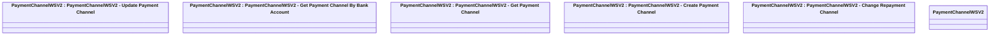

# PaymentChannelWSV2

```mermaid
classDiagram
    class PaymentChannelWSV2_PaymentChannelWSV2_Update_Payment_Channel["PaymentChannelWSV2 : PaymentChannelWSV2 - Update Payment Channel"]
    class PaymentChannelWSV2_PaymentChannelWSV2_Get_Payment_Channel_By["PaymentChannelWSV2 : PaymentChannelWSV2 - Get Payment Channel By Bank Account"]
    class PaymentChannelWSV2_PaymentChannelWSV2_Get_Payment_Channel["PaymentChannelWSV2 : PaymentChannelWSV2 - Get Payment Channel"]
    class PaymentChannelWSV2_PaymentChannelWSV2_Create_Payment_Channel["PaymentChannelWSV2 : PaymentChannelWSV2 - Create Payment Channel"]
    class PaymentChannelWSV2_PaymentChannelWSV2_Change_Repayment_Chann["PaymentChannelWSV2 : PaymentChannelWSV2 - Change Repayment Channel"]
    class PaymentChannelWSV2["PaymentChannelWSV2"]
```
