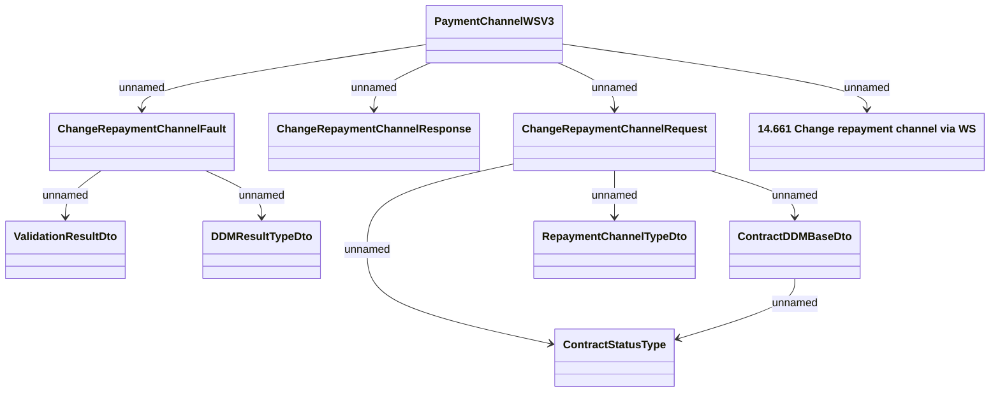

# PaymentChannelWSV3 - Change Repayment Channel

```mermaid
classDiagram
    class ValidationResultDto["ValidationResultDto"]
    class DDMResultTypeDto["DDMResultTypeDto"]
    class ChangeRepaymentChannelFault["ChangeRepaymentChannelFault"]
    class ChangeRepaymentChannelResponse["ChangeRepaymentChannelResponse"]
    class ContractDDMBaseDto["ContractDDMBaseDto"]
    class RepaymentChannelTypeDto["RepaymentChannelTypeDto"]
    class ContractStatusType["ContractStatusType"]
    class ChangeRepaymentChannelRequest["ChangeRepaymentChannelRequest"]
    class n_14_661_Change_repayment_channel_via_WS["14.661 Change repayment channel via WS"]
    class PaymentChannelWSV3["PaymentChannelWSV3"]
    PaymentChannelWSV3 --> ChangeRepaymentChannelFault : unnamed
    PaymentChannelWSV3 --> ChangeRepaymentChannelResponse : unnamed
    PaymentChannelWSV3 --> ChangeRepaymentChannelRequest : unnamed
    PaymentChannelWSV3 --> n_14_661_Change_repayment_channel_via_WS : unnamed
    ChangeRepaymentChannelRequest --> ContractDDMBaseDto : unnamed
    ChangeRepaymentChannelRequest --> ContractStatusType : unnamed
    ChangeRepaymentChannelRequest --> RepaymentChannelTypeDto : unnamed
    ChangeRepaymentChannelFault --> DDMResultTypeDto : unnamed
    ChangeRepaymentChannelFault --> ValidationResultDto : unnamed
    ContractDDMBaseDto --> ContractStatusType : unnamed
```
