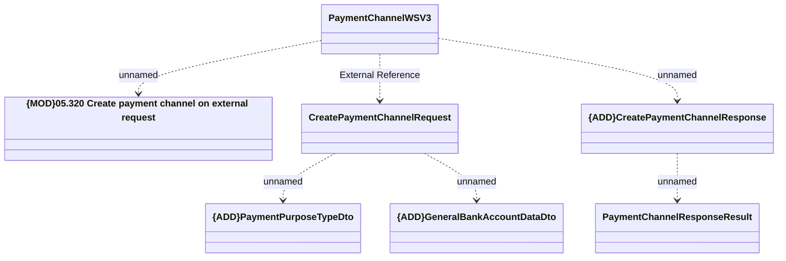

# PaymentChannelWSV3 - Create Payment Channel

- **Diagram Type**: Logical
- **Package**: HomerSelect/BSL/Analysis Model/_Interface/Provided Web Services/Payments/PaymentChannelWS/PaymentChannelWSV3
- **Diagram ID**: 127865
- **Elements**: 7
- **Connectors**: 6

