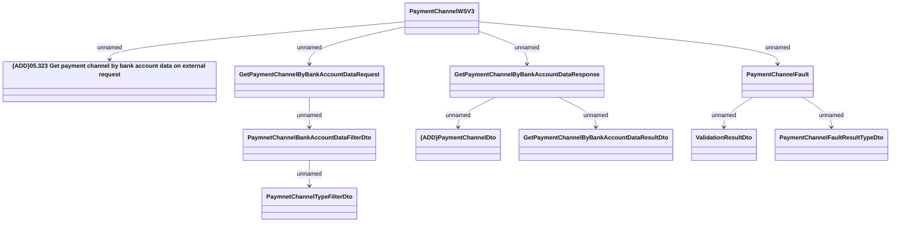

# PaymentChannelWSV3 - Get Payment Channel By Bank Account

```mermaid
classDiagram
    class ADD_05_323_Get_payment_channel_by_bank_account_data_on_exter["{ADD}05.323 Get payment channel by bank account data on external request"]
    class PaymnetChannelTypeFilterDto["PaymnetChannelTypeFilterDto"]
    class PaymnetChannelBankAccountDataFilterDto["PaymnetChannelBankAccountDataFilterDto"]
    class GetPaymentChannelByBankAccountDataRequest["GetPaymentChannelByBankAccountDataRequest"]
    class ADD_PaymentChannelDto["{ADD}PaymentChannelDto"]
    class GetPaymentChannelByBankAccountDataResultDto["GetPaymentChannelByBankAccountDataResultDto"]
    class GetPaymentChannelByBankAccountDataResponse["GetPaymentChannelByBankAccountDataResponse"]
    class ValidationResultDto["ValidationResultDto"]
    class PaymentChannelFaultResultTypeDto["PaymentChannelFaultResultTypeDto"]
    class PaymentChannelFault["PaymentChannelFault"]
    class PaymentChannelWSV3["PaymentChannelWSV3"]
    PaymentChannelWSV3 --> GetPaymentChannelByBankAccountDataResponse : unnamed
    PaymentChannelWSV3 --> ADD_05_323_Get_payment_channel_by_bank_account_data_on_exter : unnamed
    PaymentChannelWSV3 --> PaymentChannelFault : unnamed
    PaymentChannelWSV3 --> GetPaymentChannelByBankAccountDataRequest : unnamed
    PaymentChannelFault --> PaymentChannelFaultResultTypeDto : unnamed
    PaymentChannelFault --> ValidationResultDto : unnamed
    GetPaymentChannelByBankAccountDataResponse --> ADD_PaymentChannelDto : unnamed
    GetPaymentChannelByBankAccountDataResponse --> GetPaymentChannelByBankAccountDataResultDto : unnamed
    GetPaymentChannelByBankAccountDataRequest --> PaymnetChannelBankAccountDataFilterDto : unnamed
    PaymnetChannelBankAccountDataFilterDto --> PaymnetChannelTypeFilterDto : unnamed
```
